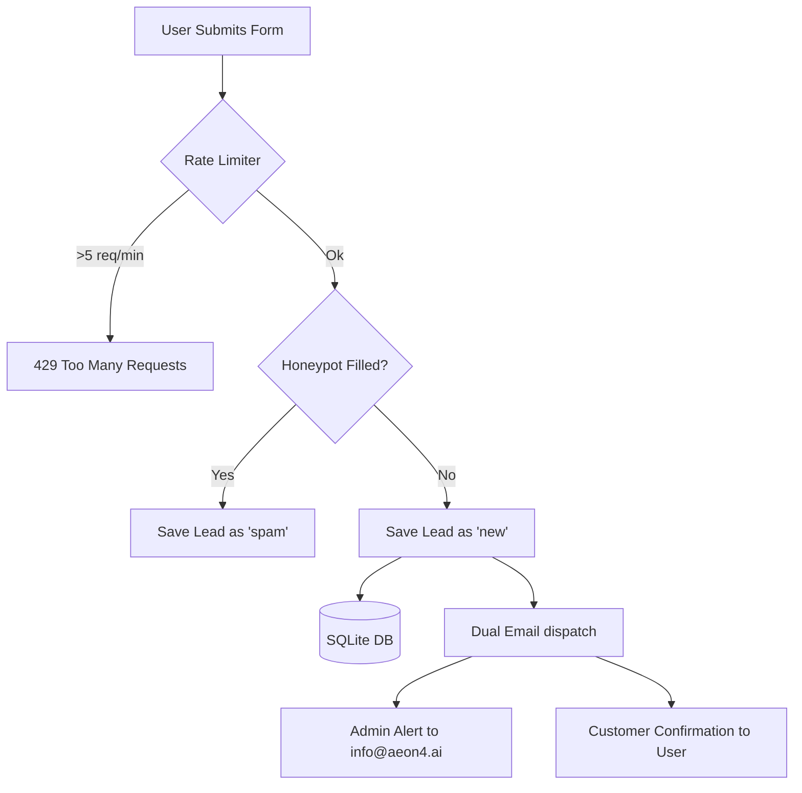

# AeOn4.AI Lead Collection & Enquiry Management Strategy

This document outlines the full strategy, requirements, and methods for secure lead capture, dual-email notifications (admin alerts and customer confirmations), and enquiry management.

---

## 1. Technical Strategy for Lead Collection

To handle incoming pilot requests securely and reliably, the platform uses a **three-layered capture pipeline**:



### Key Security & Reliability Measures
1. **Database Persistence**: Every enquiry is immediately written to the local SQLite database. Even if the mail server is down or slow, the lead is never lost.
2. **Spam Prevention (Honeypot)**: The frontend form includes a hidden input (`website`) that is invisible to humans but auto-filled by spam bots. If this field contains any data, the lead is automatically marked as `spam` in the database and no emails are sent.
3. **API Rate Limiting**: The backend limits submissions to **5 per minute per IP address** using NestJS `ThrottlerModule` to prevent DDoS or email bombing.

---

## 2. Dual-Email Confirmation Architecture

To make the platform feel premium, when a genuine user submits an enquiry, the system will trigger **two separate emails** sent from `info@aeon4.ai`:

### A. Admin Notification Email
* **Recipient**: `info@aeon4.ai` (or configured via `LEADS_NOTIFY_TO`)
* **Sender**: `info@aeon4.ai`
* **Purpose**: Alerts the operations team of the new request with all form inputs (Name, Email, Company, Facility, Country, Message).

### B. Customer Confirmation Email
* **Recipient**: The user's submitted email
* **Sender**: `info@aeon4.ai`
* **Purpose**: A beautifully designed, professional confirmation acknowledging receipt, outlining next steps, and establishing brand trust.

#### Sample Design of the Customer Confirmation Email:
```html
<div style="font-family:-apple-system,BlinkMacSystemFont,Segoe UI,Roboto,sans-serif;padding:32px;background:#f8fafc;">
  <div style="max-width:600px;margin:0 auto;background:#ffffff;border-radius:12px;border:1px solid #e2e8f0;padding:40px;box-shadow:0 4px 12px rgba(0,0,0,0.03);">
    <h2 style="color:#0f172a;margin-top:0;">Thank you for requesting an AeOn4 pilot</h2>
    <p style="color:#334155;line-height:1.6;font-size:15px;">
      Hello <strong>{Name}</strong>,
    </p>
    <p style="color:#334155;line-height:1.6;font-size:15px;">
      We have successfully received your request for an AeOn4.AI pilot for your <strong>{Facility}</strong> facility in <strong>{Country}</strong>.
    </p>
    <p style="color:#334155;line-height:1.6;font-size:15px;">
      One of our systems engineers will review your telemetry requirements and reach out to you shortly to arrange a demonstration.
    </p>
    <hr style="border:0;border-top:1px solid #e2e8f0;margin:24px 0;" />
    <p style="font-size:12px;color:#64748b;margin:0;">
      AeOn4.AI operations team · info@aeon4.ai
    </p>
  </div>
</div>
```

---

## 3. Production SMTP Configuration

To send real emails using `info@aeon4.ai`, the backend environment variables in `backend/.env` must be configured with a real SMTP service (e.g., Google Workspace, Microsoft 365, Resend, or SendGrid).

### Required Environment Configuration (`backend/.env`):
```env
SMTP_HOST=smtp.your-email-provider.com  # e.g., smtp.gmail.com or smtp.office365.com
SMTP_PORT=587                           # Standard secure submission port
SMTP_SECURE=false                       # False for port 587 (uses STARTTLS), true for port 465 (SSL)
SMTP_USER=info@aeon4.ai                 # Your authenticating SMTP username
SMTP_PASS=your-smtp-app-password        # Your SMTP authentication password/app-token
SMTP_FROM="AeOn4.AI <info@aeon4.ai>"     # The sender header displayed to recipients
LEADS_NOTIFY_TO="info@aeon4.ai"         # The mailbox where admin notifications are sent
```

---

## 4. How to View Previously Made Enquiries

We have three distinct methods to view, search, and manage submitted enquiries depending on the desired workflow:

### **Method A: Premium Admin Dashboard UI (Recommended)**
We can build a beautiful, secure `/admin` dashboard directly inside the Next.js frontend app. 
* **How it works**: The user navigates to `http://localhost:3100/admin`, enters the `ADMIN_API_KEY` (configured in `.env`), and views a sleek dashboard where they can search, filter, and inspect all inquiries.
* **Pros**: Visually stunning, fast, and does not require writing terminal commands or using database viewers.

### **Method B: Prisma Studio (Developer GUI)**
Prisma includes a built-in web-based database browser out of the box.
* **How it works**: Run `npx prisma studio` in the `backend` directory. This launches a browser tab at `http://localhost:5555` where you can view, edit, search, and delete leads from the SQLite database.
* **Pros**: Instantly available, no extra code required.

### **Method C: API Request (JSON Output)**
Direct programmatic access.
* **How it works**: Make a GET request to `http://localhost:4000/api/leads` using an API client (like Postman or curl) with the header:
  `x-api-key: <ADMIN_API_KEY>`
* **Pros**: Great for exporting data to other systems.
